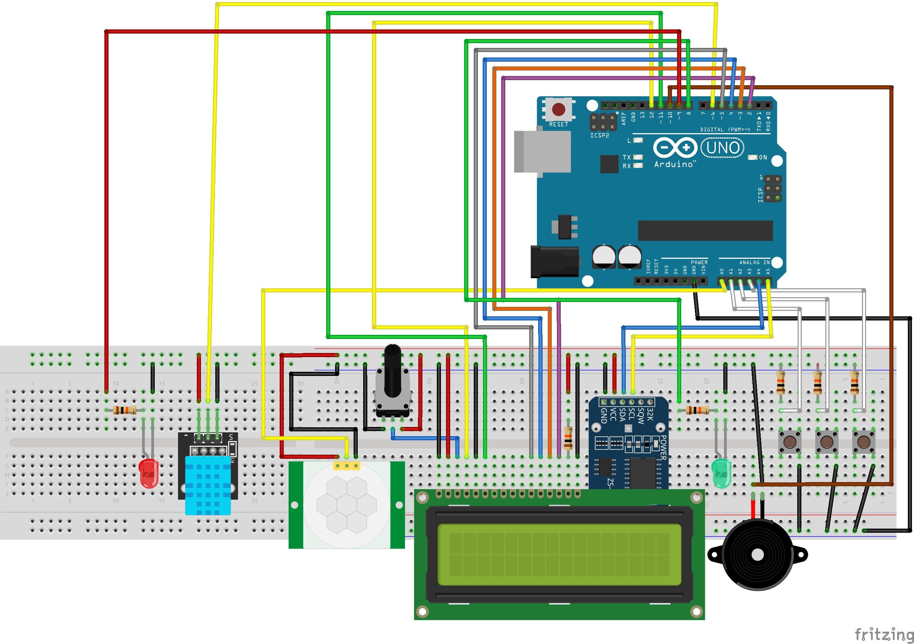

# alarmuino_tempsor

Alarm clock with display, that can be turned off by a motion sensor. 

Product Evolution:
v1.0 - Simple LCD Alarm Clock
v1.1 - LCD Alarm Clock that displays temperature and Humidity, and the alarm can be turned off by a motion sensor. (currently here)

Hardware currently in use:
- Arduino UNO
- LCD
- RTC DS3231
- 3X Buttons
- 6X 10K Resistor
- 2X LED
- Minimal Buzzer
- 10k Potentiometer
- DHT 11
- PIR sensor - 120° 7m - 3,6-20Vdc (HC-SR501)

## The schematics are slighly different than the picture, but the pin allocations are the same. Changes were made to facilitate readibility.

